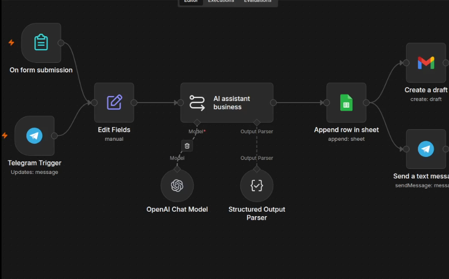

# 🤖 AI Contact Form Automation

Automatically capture website contact form submissions, qualify leads with AI, save them to Google Sheets, and notify your team instantly.

---

# 🤖 AI Contact Form Automation

   

---

## 🚀 Features

- 🌐 Capture website contact form submissions
- 🤖 AI-powered lead qualification
- 📊 Store leads in Google Sheets
- 📧 Automatic acknowledgment email
- 🔔 Instant team notification
- ⚡ Built with n8n

---

## 🏗️ Workflow

```text
Website Form
      │
      ▼
Webhook
      │
      ▼
AI Analysis
      │
      ├────────► Google Sheets
      │
      ├────────► Gmail Auto Reply
      │
      └────────► Team Notification
```

---

## 🛠️ Tech Stack

- n8n
- OpenAI
- Gmail
- Google Sheets
- Telegram

---

## 📷 Preview

### Workflow



---

### Result


---

## 💼 Business Value

Instead of manually checking emails and copying customer information into spreadsheets, every inquiry is processed automatically in seconds.

Perfect for:

- Agencies
- SaaS
- Freelancers
- Consultants
- Local businesses

---

## 📥 Download

⭐ Free workflow available on GitHub.

Production version available on request.


---

## 🏗️ Architecture


---

## 👨‍💻 Author

**Shikara Systems**

AI Automation Solutions for Modern Businesses.
